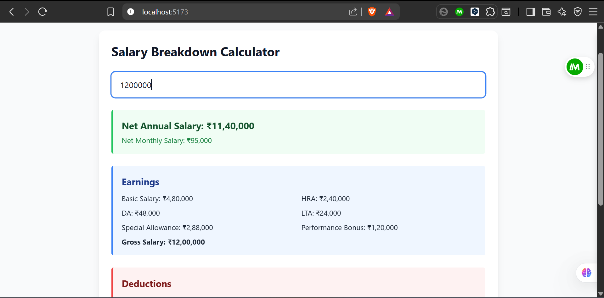
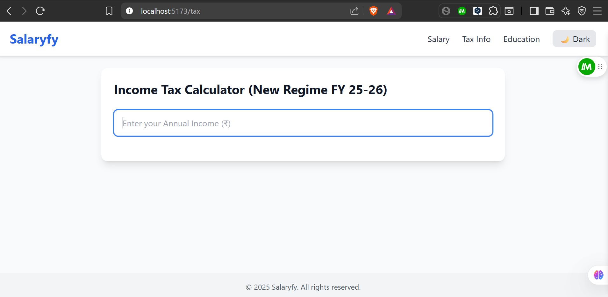

# Salaryfy

Salaryfy is a web application that helps users calculate their **salary breakdown** and **income tax** under the new Indian tax regime FY 25-26. It provides a detailed step-by-step explanation of earnings, deductions, and net income.

It allows users to:

1. Break down their CTC (Cost to Company) into components like Basic Salary, HRA, DA, LTA, Bonus, and Special Allowance.
2. Calculate deductions including Provident Fund, Professional Tax, and Income Tax.
3. Determine their Net Annual and Monthly Salary with detailed insights.
4. Understand the step-by-step tax calculation, including slabs, rebates, marginal relief, and health & education cess.
5. Export salary and tax reports to Excel for record-keeping.

The app also supports a light/dark mode toggle, making it visually adaptable to user preference.

**Goal:** To simplify complex salary and tax calculations, giving employees clear visibility into their earnings, deductions, and taxes.

---

## **Features**

- Calculate **Net Annual** and **Net Monthly Salary** based on CTC.  
- Detailed **Earnings & Deductions** breakdown.  
- Step-by-step **Income Tax Calculation** with slabs, rebates, and marginal relief.  
- Download **Excel Reports** for Salary & Tax details.  
- Light/Dark mode toggle for better user experience.  

---

## **Installation**

1.Clone the repository: git clone https://github.com/username/salaryfy.git

2.Navigate to the project folder: cd salaryfy

3.Install Dependencies: npm install

4.Start the development server: npm run dev

## **Usage**

1.Go to the Salary page to enter your CTC and see the detailed salary breakdown.

2.Go to the Tax page to enter your annual income and calculate tax.

3.Use the Download Excel button to save reports.

4.Toggle between Light/Dark mode using the Navbar.

## **Technologies Used**

React.js

Tailwind CSS

React Router

XLSX (for Excel export)

Context API (for theme toggle)

## Screenshots

### Salary Page

### Tax Page

### Tax page working

### Financial Education

